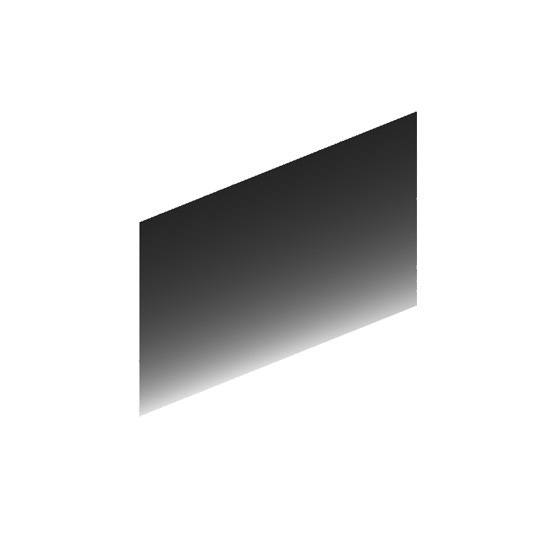
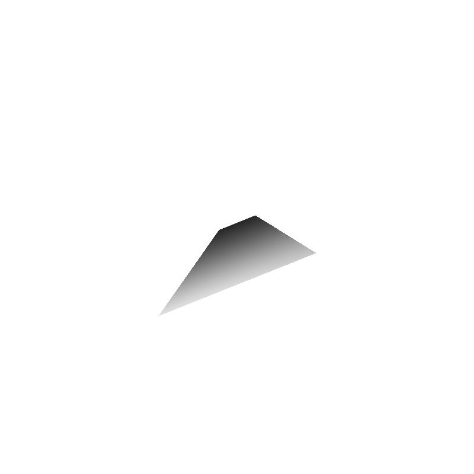

Introduction to Raytracing and Shading
======================================

The goal of this assignment was to implement our first ray tracer and get familiar with different shading.
In the first exercise, I implemented a raytracer to render spheres and planes with different projections.
In the second exercise, I extended the ray tracer to support different shading.

This was done using Eigen
Have a look at the [Getting Started](http://eigen.tuxfamily.org/dox/GettingStarted.html) page of Eigen as well as the [Quick Reference](http://eigen.tuxfamily.org/dox/group__QuickRefPage.html) page for a reference of the basic matrix operations supported.

Ex.1: Basic Ray Tracing
-----------------------

### Description

Modified the provided code to launch primary rays from the camera following a perspective projection model and implement the intersection with a parallelogram.

### Tasks

#### Ray Tracing a Parallelogram

1. Set up the parameters of the parallelogram (position of the corner, plus one vector for each side of the parallelogram)
2. Created a function to check if a ray intersects with an arbitrary parallelogram.
3. Calculated the intersection between the ray and the parallelogram using the function defined above.
4. Computed the normal of that intersection point.

#### Ray Tracing with Perspective Projection

5. Modifed the ray-sphere intersection to follow the generic case we saw in class.
6. Modifed the ray equation for perspective projection.
7. Compared the difference in the result for a sphere for a parallelogram (you can also create a scene with multiple objects).

Ex.2: Shading
-------------

### Description

Implemented the shading equations introduced in class.

### Tasks

1. Implemented basic shading components: ambient, specular, and diffuse.
2. Added RGB components instead of the current grey-scale one.
3. Experimented with the different parameters and observed their effect on the ray-traced shapes.

Output
-------------

Parallelogram with orthographic projection:

Parallelogram with perspective projection:

Sphere with perspective projection and colors:
