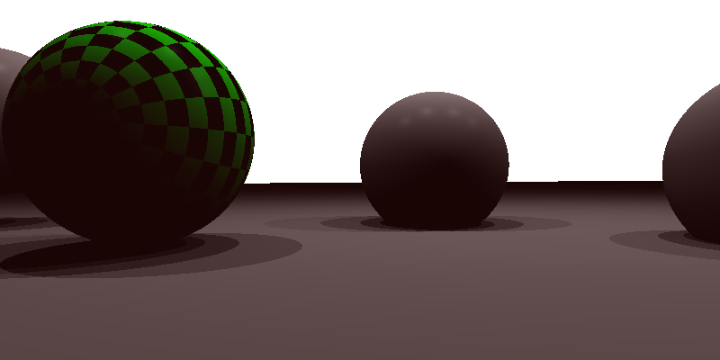
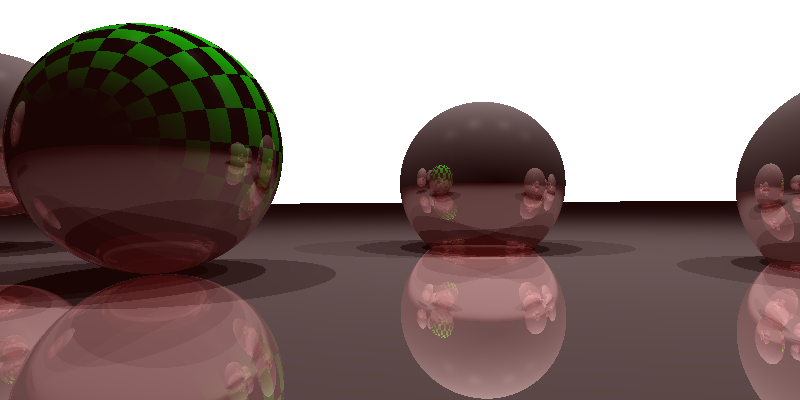

Basic Raytracing Effects
========================

For this assignment I implemented basic ray tracing effects such as shadows, reflection, refraction and depth of field.

### Using Eigen

This was done using Eigen
Have a look at the [Getting Started](http://eigen.tuxfamily.org/dox/GettingStarted.html) page of Eigen as well as the [Quick Reference](http://eigen.tuxfamily.org/dox/group__QuickRefPage.html) page for a reference of the basic matrix operations supported.

Ex 0: Implement the intersection code:
------------------------------------------

Filled the functions `ray_sphere_intersection` and `ray_parallelogram_intersection` with the correct intersection between the ray and the primitives.

Output with sphere intersection

Output with sphere and plane intersection

Ex 1: Field of View and Perspective Camera:
------------------------------------------

Filled the starter code to compute the correct value of `h` (`image_y` in the code).
Implemented the perspective camera similarly to Assignment 1.

Output with correct `image_x` and `image_y`

Output with correct `image_x` and `image_y` and perspective camera (remember to change `is_perspective` to `true`)

Ex.2: Shadow Rays:
-----------------

Implemented Phong shading (diffuse and specular color)Fill in Implemented shadow rays by implementing the function `is_light_visible`.

Output with correct shading

Output with shadows

Reflection:
-----------------------

Implemented reflected rays

Output with reflections

Perlin Noise
-------------------------

Implemented Perlin noise as explained in class.

Implemented the linear interpolation
Implemented the `dotGridGradient` function
Get the correct grid coordinates from the point `x` and `y`
Replaced the linear interpolation with a cubic interpolation `(a1 - a0) * (3.0 - w * 2.0) * w * w + a0` and compared the results.

Output with linear interpolation

Output with cubic interpolation
