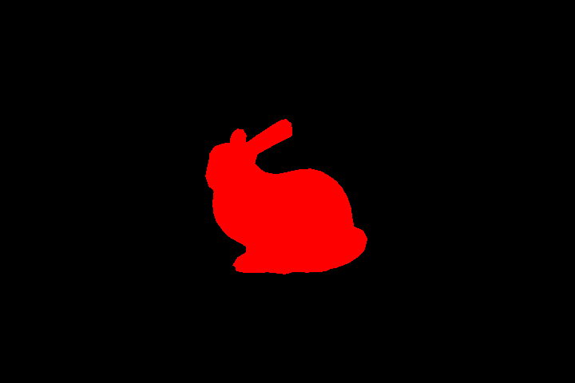
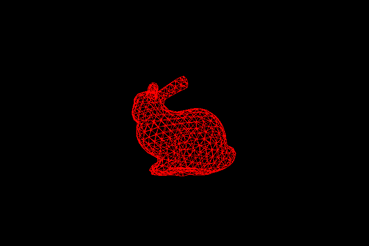

Rasterization Basics
===============

The goal of the final assignment was to implement a rendering system for triangulated 3D models based on rasterization. modifying `attributes.h` as necessary.

### Using Eigen

This was done using Eigen
Have a look at the [Getting Started](http://eigen.tuxfamily.org/dox/GettingStarted.html) page of Eigen as well as the [Quick Reference](http://eigen.tuxfamily.org/dox/group__QuickRefPage.html) page for a reference of the basic matrix operations supported.

Ex.1: Load and Render a 3D model
------------------

The provided code rasterizes a triangle using the software rasterizer we studied in the class. Extend the provided code to load the same scenes used in Assignment 4, and render them using rasterization in a uniform color. At this stage, you should see a correct silhouette of the object rendered. The cameras should take into account the size of the framebuffer, properly adapting the aspect ratio to not distort the image whenever the framebuffer is resized. Remember that all transformations **must** be applied in the vertex shader. To check for correctness, we recommend to render a cube in wireframe mode.

1. Build the camera tranformation matrix
2. Build the Orthographic Projection matrix, see Assignment 3 for computing t and l.
3. Fill the shaders to rasterize the bunny in red

My output:

Ex.2:
----------------

Render the bunny using a wireframe; only the edges of the triangles are drawn.

My output:

Ex.3: Shading
-------------

In this exercise, you will implement two different shading options for the triangles: flat shading, and per vertex shading. The scene should always contain at least one light source, set as a shader uniform. Both flat shading and per-vertex shading should use the same code in the shader program. The only difference lies in the attributes that are sent to the vertex shader. You can reuse the code from the ray-tracing assignment for the lighting equation (you should implement both *diffuse* and *specular* shading components in the vertex, or fragment if you prefer, shader).

In **Flat Shading** each triangle is rendered using a unique normal (i.e. the normal of all the fragments that compose a triangle is simply the normal of the plane that contains it).

In **Per-Vertex Shading** the normals are specified on the vertices of the mesh, the color is computed for each vertex, and then interpolated in the interior of the triangle.

1. Implement the light equation
2. Implement the depth check
3. Compute the per face normals and render the bunny with flat shading
4. Compute the per vertex normals and render the bunny with vertex shading

Note that to perform flat shading, you will need to send per-face normal attributes to the shader program. However, with the provided rasterizer and for most modern APIs, it is only possible to send *per-vertex* attributes. One simple way to go around this limitation is simply to duplicate the input vertices for every triangle in the mesh. That is, from a pair **(V, F)** describing the mesh coordinates and triangles, build a new pair **(V', F')**, where every vertex from **V'** appears only once in **F'**.

To compute the per-vertex normals you should first compute the per-face normals, and then average them on the neighboring vertices. In other words, the normal of the vertex of a mesh should be the average of the normals of the faces touching it. Remember to normalize the normals after averaging.

My output for flat shading:

This is the expected for vertex shading

Ex.3: Object Transformation:
----------------------------------

Add an option to rotate the object around the y-axis centered on its barycenter, all transformations **must** be applied in the shaders. Produce 3 gif videos, one for each rendering type used above (i.e., wireframe, flat, and vertex).

My animation for flat shading

Ex.4: Camera
-------------------------------

Implement a *perspective camera*. Note that for the shading to be correct, the lighting equation need to be computed in the camera space (sometimes called the *eye space*). This is because in the camera space the position of the camera center is known (it is (0,0,0)), but in the canonical viewing volume normals can be distorted by the perspective projection, so shading will be computed incorrectly.

My output for flat shading and perspective camera

My output for vertex shading and perspective camera

